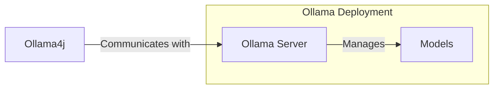

### Ollama4j


A Java library (wrapper/binding) for [Ollama](https://ollama.ai/) server.

Find more details on the [website](https://amithkoujalgi.github.io/ollama4j/).


[](https://codecov.io/gh/amithkoujalgi/ollama4j)


## Table of Contents

- [How does it work?](#how-does-it-work)
- [Requirements](#requirements)
- [Installation](#installation)
- [API Spec](#api-spec)
- [Demo APIs](#try-out-the-apis-with-ollama-server)
- [Development](#development)
- [Contributions](#get-involved)
- [References](#references)

#### How does it work?



#### Requirements


[![][ollama-shield]][ollama] **Or** [![][ollama-docker-shield]][ollama-docker]

[ollama]: https://ollama.ai/

[ollama-shield]: https://img.shields.io/badge/Ollama-Local_Installation-blue.svg?style=just-the-message&labelColor=gray

[ollama-docker]: https://hub.docker.com/r/ollama/ollama

[ollama-docker-shield]: https://img.shields.io/badge/Ollama-Docker-blue.svg?style=just-the-message&labelColor=gray

#### Installation

In your Maven project, add this dependency:

```xml

<dependency>
    <groupId>io.github.amithkoujalgi</groupId>
    <artifactId>ollama4j</artifactId>
    <version>1.0.40</version>
</dependency>
```

Latest release:


[![][lib-shield]][lib]

[lib]: https://central.sonatype.com/artifact/io.github.amithkoujalgi/ollama4j

[lib-shield]: https://img.shields.io/badge/ollama4j-get_latest_version-blue.svg?style=just-the-message&labelColor=gray

#### API Spec

Find the full API specifications on the [website](https://amithkoujalgi.github.io/ollama4j/).

#### Development

Build:

```shell
make build
```

Run unit tests:

```shell
make ut
```

Run integration tests:

```shell
make it
```

#### Releases

Releases (newer artifact versions) are done automatically on pushing the code to the `main` branch through GitHub
Actions CI workflow.

#### Traction

[](https://star-history.com/#amithkoujalgi/ollama4j&Date)

### Areas of improvement

- [x] Use Java-naming conventions for attributes in the request/response models instead of the
  snake-case conventions. (
  possibly with Jackson-mapper's `@JsonProperty`)
- [x] Fix deprecated HTTP client code
- [x] Setup logging
- [x] Use lombok
- [x] Update request body creation with Java objects
- [ ] Async APIs for images
- [ ] Add custom headers to requests
- [ ] Add additional params for `ask` APIs such as:
    - `options`: additional model parameters for the Modelfile such as `temperature`
    - `system`: system prompt to (overrides what is defined in the Modelfile)
    - `template`: the full prompt or prompt template (overrides what is defined in the Modelfile)
    - `context`: the context parameter returned from a previous request, which can be used to keep a
      short
      conversational memory
    - `stream`: Add support for streaming responses from the model
- [ ] Add test cases
- [ ] Handle exceptions better (maybe throw more appropriate exceptions)

### Get Involved

Contributions are most welcome! Whether it's reporting a bug, proposing an enhancement, or helping
with code - any sort
of contribution is much appreciated.

### Credits

The nomenclature and the icon have been adopted from the incredible [Ollama](https://ollama.ai/)
project.

### References

- [Ollama REST APIs](https://github.com/jmorganca/ollama/blob/main/docs/api.md)
