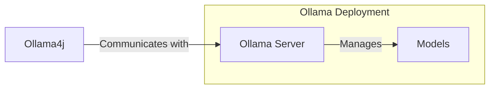

### Ollama4j

<p align="center">
  
</p>

<div align="center">
A Java library (wrapper/binding) for Ollama server.

Find more details on the [website](https://ollama4j.github.io/ollama4j/).


[//]: # (![GitHub repo size]&#40;https://img.shields.io/github/repo-size/ollama4j/ollama4j&#41;)

[//]: # (![GitHub top language]&#40;https://img.shields.io/github/languages/top/ollama4j/ollama4j&#41;)


[//]: # (![JitPack Downloads This Month Badge]&#40;https://img.shields.io/badge/dynamic/json?url=https%3A%2F%2Fjitpack.io%2Fapi%2Fdownloads%2Fio.github.ollama4j%2Follama4j&query=%24.month&label=JitPack%20Downloads%20-%20This%20Month&#41;)

[//]: # (![JitPack Downloads This Week Badge]&#40;https://img.shields.io/badge/dynamic/json?url=https%3A%2F%2Fjitpack.io%2Fapi%2Fdownloads%2Fio.github.ollama4j%2Follama4j&query=%24.week&label=JitPack%20Downloads%20-%20This%20Week&#41;)

[//]: # (![JitPack Downloads Per Month Badge]&#40;https://jitpack.io/v/ollama4j/ollama4j/month.svg&#41;)

[//]: # (![GitHub Downloads &#40;all assets, all releases&#41;]&#40;https://img.shields.io/github/downloads/ollama4j/ollama4j/total?label=GitHub%20Package%20Downloads&#41;)


[](https://codecov.io/gh/ollama4j/ollama4j)

[](https://github.com/ollama4j/ollama4j/actions/workflows/run-tests.yml)


</div>

[//]: # (![Hits]&#40;https://hits.seeyoufarm.com/api/count/incr/badge.svg?url=https%3A%2F%2Fgithub.com%2Follama4j%2Follama4j&count_bg=%2379C83D&title_bg=%23555555&icon=&icon_color=%23E7E7E7&title=hits&edge_flat=false&#41;)

[//]: # (![GitHub language count]&#40;https://img.shields.io/github/languages/count/ollama4j/ollama4j&#41;)

## Table of Contents

- [How does it work?](#how-does-it-work)
- [Requirements](#requirements)
- [Installation](#installation)
- [API Spec](https://ollama4j.github.io/ollama4j/category/apis---model-management)
- [Examples](#examples)
- [Javadoc](https://ollama4j.github.io/ollama4j/apidocs/)
- [Development](#development)
- [Contributions](#get-involved)
- [References](#references)

#### How does it work?



#### Requirements


<a href="https://ollama.com/" target="_blank">
  
</a>

## Installation

> [!NOTE]
> We are now publishing the artifacts to both Maven Central and GitHub package repositories.
>
> Track the releases [here](https://github.com/ollama4j/ollama4j/releases) and update the dependency version
> according to your requirements.

### For Maven

#### Using [Maven Central](https://central.sonatype.com/)

[![][ollama4j-mvn-releases-shield]][ollama4j-mvn-releases-link]

[ollama4j-mvn-releases-link]: https://central.sonatype.com/artifact/io.github.ollama4j/ollama4j/overview

[ollama4j-mvn-releases-shield]: https://img.shields.io/maven-central/v/io.github.ollama4j/ollama4j?display_name=release&style=for-the-badge&label=From%20Maven%20Central

In your Maven project, add this dependency:

```xml

<dependency>
    <groupId>io.github.ollama4j</groupId>
    <artifactId>ollama4j</artifactId>
    <version>1.0.100</version>
</dependency>
```

#### Using GitHub's Maven Package Repository

[![][ollama4j-releases-shield]][ollama4j-releases-link]

[ollama4j-releases-link]: https://github.com/ollama4j/ollama4j/releases

[ollama4j-releases-shield]: https://img.shields.io/github/v/release/ollama4j/ollama4j?display_name=release&style=for-the-badge&label=From%20GitHub%20Packages

1. Add `GitHub Maven Packages` repository to your project's `pom.xml` or your `settings.xml`:

```xml

<repositories>
    <repository>
        <id>github</id>
        <name>GitHub Apache Maven Packages</name>
        <url>https://maven.pkg.github.com/ollama4j/ollama4j</url>
        <releases>
            <enabled>true</enabled>
        </releases>
        <snapshots>
            <enabled>true</enabled>
        </snapshots>
    </repository>
</repositories>
```

2. Add `GitHub` server to settings.xml. (Usually available at ~/.m2/settings.xml)

```xml

<settings xmlns="http://maven.apache.org/SETTINGS/1.0.0"
          xmlns:xsi="http://www.w3.org/2001/XMLSchema-instance"
          xsi:schemaLocation="http://maven.apache.org/SETTINGS/1.0.0
                      http://maven.apache.org/xsd/settings-1.0.0.xsd">
    <servers>
        <server>
            <id>github</id>
            <username>YOUR-USERNAME</username>
            <password>YOUR-TOKEN</password>
        </server>
    </servers>
</settings>
```

3. In your Maven project, add this dependency:

```xml

<dependency>
    <groupId>io.github.ollama4j</groupId>
    <artifactId>ollama4j</artifactId>
    <version>1.0.100</version>
</dependency>
```

### For Gradle

1. Add the dependency

```groovy
dependencies {
    implementation 'io.github.ollama4j:ollama4j:1.0.100'
}
```

[//]: # (Latest release:)

[//]: # ()

[//]: # (![Maven Central]&#40;https://img.shields.io/maven-central/v/io.github.ollama4j/ollama4j&#41;)

[//]: # ()

[//]: # ([![][lib-shield]][lib])

[lib]: https://central.sonatype.com/artifact/io.github.ollama4j/ollama4j

[lib-shield]: https://img.shields.io/badge/ollama4j-get_latest_version-blue.svg?style=just-the-message&labelColor=gray

#### API Spec

> [!TIP]
> Find the full API specifications on the [website](https://ollama4j.github.io/ollama4j/).

### Development

Make sure you have `pre-commit` installed.

With `brew`:

```shell
brew install pre-commit
```

With `pip`:

```shell
pip install pre-commit
```

#### Setup dev environment

> **Note**
> If you're on Windows, install [Chocolatey Package Manager for Windows](https://chocolatey.org/install) and then install `make` by running `choco install make`. Just a little tip - run the command with administrator privileges if installation faiils.

```shell
make dev
```

#### Build

```shell
make build
```

#### Run unit tests

```shell
make unit-tests
```

#### Run integration tests

Make sure you have Docker running as this uses [testcontainers](https://testcontainers.com/) to run the integration
tests on Ollama Docker container.

```shell
make integration-tests
```

### Releases

Newer artifacts are published via GitHub Actions CI workflow when a new release is created from `main` branch.

## Examples

The `ollama4j-examples` repository contains examples for using the Ollama4j library. You can explore
it [here](https://github.com/ollama4j/ollama4j-examples).

## ⭐ Give us a Star!

If you like or are using this project to build your own, please give us a star. It's a free way to show your support.

## Who's using Ollama4j?

| #  | Project Name      | Description                                                                                                                                                        | Link                                                                                                                                                                                          |
|----|-------------------|--------------------------------------------------------------------------------------------------------------------------------------------------------------------|-----------------------------------------------------------------------------------------------------------------------------------------------------------------------------------------------|
| 1  | Datafaker         | A library to generate fake data                                                                                                                                    | [GitHub](https://github.com/datafaker-net/datafaker-experimental/tree/main/ollama-api)                                                                                                        |
| 2  | Vaadin Web UI     | UI-Tester for interactions with Ollama via ollama4j                                                                                                                | [GitHub](https://github.com/TEAMPB/ollama4j-vaadin-ui)                                                                                                                                        |
| 3  | ollama-translator | A Minecraft 1.20.6 Spigot plugin that translates all messages into a specific target language via Ollama                                                           | [GitHub](https://github.com/liebki/ollama-translator)                                                                                                                                         |
| 4  | AI Player         | A Minecraft mod that adds an intelligent "second player" to the game                                                                                               | [Website](https://modrinth.com/mod/ai-player), [GitHub](https://github.com/shasankp000/AI-Player), <br/> [Reddit Thread](https://www.reddit.com/r/fabricmc/comments/1e65x5s/comment/ldr2vcf/) |
| 5  | Ollama4j Web UI   | A web UI for Ollama written in Java using Spring Boot, Vaadin, and Ollama4j                                                                                        | [GitHub](https://github.com/ollama4j/ollama4j-web-ui)                                                                                                                                         |
| 6  | JnsCLI            | A command-line tool for Jenkins that manages jobs, builds, and configurations, with AI-powered error analysis                                                      | [GitHub](https://github.com/mirum8/jnscli)                                                                                                                                                    |
| 7  | Katie Backend     | An open-source AI-based question-answering platform for accessing private domain knowledge                                                                         | [GitHub](https://github.com/wyona/katie-backend)                                                                                                                                              |
| 8  | TeleLlama3 Bot    | A question-answering Telegram bot                                                                                                                                  | [Repo](https://git.hiast.edu.sy/mohamadbashar.disoki/telellama3-bot)                                                                                                                          |
| 9  | moqui-wechat      | A moqui-wechat component                                                                                                                                           | [GitHub](https://github.com/heguangyong/moqui-wechat)                                                                                                                                         |
| 10 | B4X               | A set of simple and powerful RAD tool for Desktop and Server development                                                                                           | [Website](https://www.b4x.com/android/forum/threads/ollama4j-library-pnd_ollama4j-your-local-offline-llm-like-chatgpt.165003/)                                                                |
| 11 | Research Article  | Article: `Large language model based mutations in genetic improvement` - published on National Library of Medicine (National Center for Biotechnology Information) | [Website](https://pmc.ncbi.nlm.nih.gov/articles/PMC11750896/)                                                                                                                                 |

## Traction

[](https://star-history.com/#ollama4j/ollama4j&Date)

## Get Involved

<div align="center">

<a href=""></a>
<a href=""></a>
<a href=""></a>
<a href=""></a>
<a href=""></a>

</div>


[//]: # (![GitHub Issues or Pull Requests]&#40;https://img.shields.io/github/issues-raw/ollama4j/ollama4j&#41;)

[//]: # (![GitHub Issues or Pull Requests]&#40;https://img.shields.io/github/issues-closed-raw/ollama4j/ollama4j&#41;)

[//]: # (![GitHub Issues or Pull Requests]&#40;https://img.shields.io/github/issues-pr-raw/ollama4j/ollama4j&#41;)

[//]: # (![GitHub Issues or Pull Requests]&#40;https://img.shields.io/github/issues-pr-closed-raw/ollama4j/ollama4j&#41;)

[//]: # (![GitHub Discussions]&#40;https://img.shields.io/github/discussions/ollama4j/ollama4j&#41;)


Contributions are most welcome! Whether it's reporting a bug, proposing an enhancement, or helping
with code - any sort
of contribution is much appreciated.

## 🏷️ License and Citation

The code is available under [MIT License](./LICENSE).

If you find this project helpful in your research, please cite this work at

```
@misc{ollama4j2024,
    author       = {Amith Koujalgi},
    title        = {Ollama4j: A Java Library (Wrapper/Binding) for Ollama Server},
    year         = {2024},
    month        = {January},
    url          = {https://github.com/ollama4j/ollama4j}
}
```

### References

- [Ollama REST APIs](https://github.com/jmorganca/ollama/blob/main/docs/api.md)

### Credits

The nomenclature and the icon have been adopted from the incredible [Ollama](https://ollama.ai/)
project.

**Thanks to the amazing contributors**

<p align="center">
  <a href="https://github.com/ollama4j/ollama4j/graphs/contributors">
    
  </a>
</p>

### Appreciate the work?

<p align="center">
  <a href="https://www.buymeacoffee.com/amithkoujalgi" target="_blank"></a>
</p>
