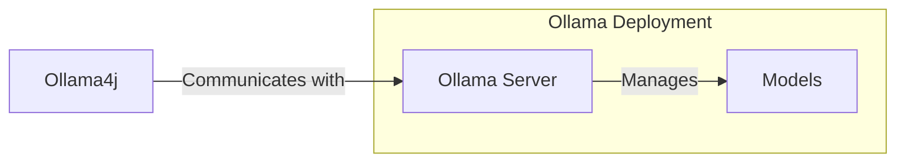

### Ollama4j


A Java library (wrapper/binding) for [Ollama](https://github.com/jmorganca/ollama/blob/main/docs/api.md) APIs.




#### Star History

[](https://star-history.com/#amithkoujalgi/ollama4j&Date)

## Table of Contents

- [Requirements](#requirements)
- [Installation](#installation)
- [Demo APIs](#try-out-the-apis)
- [API Spec](#api-spec)
- [Contributions](#get-involved)

#### Requirements

- Ollama (Either [natively](https://ollama.ai/download) setup or via [Docker](https://hub.docker.com/r/ollama/ollama))
- Java 11 or above

#### Installation

In your Maven project, add this dependency available in
the [Central Repository](https://s01.oss.sonatype.org/#nexus-search;quick~ollama4j):

```xml

<dependency>
    <groupId>io.github.amithkoujalgi</groupId>
    <artifactId>ollama4j</artifactId>
    <version>1.0-SNAPSHOT</version>
</dependency>
```

You might want to include the Maven repository to pull the ollama4j library from. Include this in your `pom.xml`:

```xml

<repositories>
    <repository>
        <id>ollama4j-from-ossrh</id>
        <url>https://s01.oss.sonatype.org/content/repositories/snapshots</url>
    </repository>
</repositories>
```

#### Build:

Build your project to resolve the dependencies:

```shell
mvn clean install -U
```

You can then use the Ollama Java APIs by importing `ollama4j`:

```java
import io.github.amithkoujalgi.ollama4j.core.OllamaAPI;
```

### Try out the APIs

For simplest way to get started, I prefer to use the Ollama docker setup.

Start the Ollama docker container:

```shell
docker run -v ~/ollama:/root/.ollama -p 11434:11434 ollama/ollama
```

With GPUs
```
docker run -d --gpus=all -v ~/ollama:/root/.ollama -p 11434:11434 ollama/ollama
```

Instantiate `OllamaAPI`

```java
public class Main {
    public static void main(String[] args) {
        String host = "http://localhost:11434/";
        OllamaAPI ollamaAPI = new OllamaAPI(host);

        // set verbose - true/false
        ollamaAPI.setVerbose(true);
    }
}
```

#### Pull a model:

```java
public class Main {
    public static void main(String[] args) {
        String host = "http://localhost:11434/";
        OllamaAPI ollamaAPI = new OllamaAPI(host);
        ollamaAPI.pullModel(OllamaModel.LLAMA2);
    }
}
```

_Find the list of available models from Ollama [here](https://ollama.ai/library)._

#### List models:

```java
public class Main {
    public static void main(String[] args) {
        String host = "http://localhost:11434/";
        OllamaAPI ollamaAPI = new OllamaAPI(host);
        List<Model> models = ollamaAPI.listModels();
        models.forEach(model -> System.out.println(model.getName()));
    }
}
```

Response:

```shell
llama2:latest
sqlcoder:latest
```

#### Get model details:

```java
public class Main {
    public static void main(String[] args) {
        String host = "http://localhost:11434/";
        OllamaAPI ollamaAPI = new OllamaAPI(host);
        ModelDetail modelDetails = ollamaAPI.getModelDetails(OllamaModelType.LLAMA2);
        System.out.println(modelDetails);
    }
}
```

Response:

```json
{
  "license": "LLAMA 2 COMMUNITY LICENSE AGREEMENT\t\nLlama 2 Version Release Date: July 18, 2023\n\n\"Agreement\" means the terms and conditions for use, reproduction, distribution and \nmodification of the Llama Materials set forth herein.\n\n\"Documentation\" means the specifications, manuals and documentation \naccompanying Llama 2 distributed by Meta at ai.meta.com/resources/models-and-\nlibraries/llama-downloads/.\n\n\"Licensee\" or \"you\" means you, or your employer or any other person or entity (if \nyou are entering into this Agreement on such person or entity\u0027s behalf), of the age \nrequired under applicable laws, rules or regulations to provide legal consent and that \nhas legal authority to bind your employer or such other person or entity if you are \nentering in this Agreement on their behalf.\n\n\"Llama 2\" means the foundational large language models and software and \nalgorithms, including machine-learning model code, trained model weights, \ninference-enabling code, training-enabling code, fine-tuning enabling code and other \nelements of the foregoing distributed by Meta at ai.meta.com/resources/models-and-\nlibraries/llama-downloads/.\n\n\"Llama Materials\" means, collectively, Meta\u0027s proprietary Llama 2 and \nDocumentation (and any portion thereof) made available under this Agreement.\n\n\"Meta\" or \"we\" means Meta Platforms Ireland Limited (if you are located in or, if you \nare an entity, your principal place of business is in the EEA or Switzerland) and Meta \nPlatforms, Inc. (if you are located outside of the EEA or Switzerland). \n\nBy clicking \"I Accept\" below or by using or distributing any portion or element of the \nLlama Materials, you agree to be bound by this Agreement.\n\n1. License Rights and Redistribution. \n\n      a. Grant of Rights. You are granted a non-exclusive, worldwide, non-\ntransferable and royalty-free limited license under Meta\u0027s intellectual property or \nother rights owned by Meta embodied in the Llama Materials to use, reproduce, \ndistribute, copy, create derivative works of, and make modifications to the Llama \nMaterials.  \n      \n      b. Redistribution and Use.  \n\n            i. If you distribute or make the Llama Materials, or any derivative works \nthereof, available to a third party, you shall provide a copy of this Agreement to such \nthird party. \n            ii.  If you receive Llama Materials, or any derivative works thereof, from \na Licensee as part of an integrated end user product, then Section 2 of this \nAgreement will not apply to you. \n\n            iii. You must retain in all copies of the Llama Materials that you \ndistribute the following attribution notice within a \"Notice\" text file distributed as a \npart of such copies: \"Llama 2 is licensed under the LLAMA 2 Community License, \nCopyright (c) Meta Platforms, Inc. All Rights Reserved.\"\n\n            iv. Your use of the Llama Materials must comply with applicable laws \nand regulations (including trade compliance laws and regulations) and adhere to the \nAcceptable Use Policy for the Llama Materials (available at \nhttps://ai.meta.com/llama/use-policy), which is hereby incorporated by reference into \nthis Agreement.\n\n            v. You will not use the Llama Materials or any output or results of the \nLlama Materials to improve any other large language model (excluding Llama 2 or \nderivative works thereof).  \n\n2. Additional Commercial Terms. If, on the Llama 2 version release date, the \nmonthly active users of the products or services made available by or for Licensee, \nor Licensee\u0027s affiliates, is greater than 700 million monthly active users in the \npreceding calendar month, you must request a license from Meta, which Meta may \ngrant to you in its sole discretion, and you are not authorized to exercise any of the \nrights under this Agreement unless or until Meta otherwise expressly grants you \nsuch rights.\n            \n3. Disclaimer of Warranty. UNLESS REQUIRED BY APPLICABLE LAW, THE \nLLAMA MATERIALS AND ANY OUTPUT AND RESULTS THEREFROM ARE \nPROVIDED ON AN \"AS IS\" BASIS, WITHOUT WARRANTIES OF ANY KIND, \nEITHER EXPRESS OR IMPLIED, INCLUDING, WITHOUT LIMITATION, ANY \nWARRANTIES OF TITLE, NON-INFRINGEMENT, MERCHANTABILITY, OR \nFITNESS FOR A PARTICULAR PURPOSE. YOU ARE SOLELY RESPONSIBLE \nFOR DETERMINING THE APPROPRIATENESS OF USING OR REDISTRIBUTING \nTHE LLAMA MATERIALS AND ASSUME ANY RISKS ASSOCIATED WITH YOUR \nUSE OF THE LLAMA MATERIALS AND ANY OUTPUT AND RESULTS.\n\n4. Limitation of Liability. IN NO EVENT WILL META OR ITS AFFILIATES BE \nLIABLE UNDER ANY THEORY OF LIABILITY, WHETHER IN CONTRACT, TORT, \nNEGLIGENCE, PRODUCTS LIABILITY, OR OTHERWISE, ARISING OUT OF THIS \nAGREEMENT, FOR ANY LOST PROFITS OR ANY INDIRECT, SPECIAL, \nCONSEQUENTIAL, INCIDENTAL, EXEMPLARY OR PUNITIVE DAMAGES, EVEN \nIF META OR ITS AFFILIATES HAVE BEEN ADVISED OF THE POSSIBILITY OF \nANY OF THE FOREGOING.\n \n5. Intellectual Property.\n\n      a. No trademark licenses are granted under this Agreement, and in \nconnection with the Llama Materials, neither Meta nor Licensee may use any name \nor mark owned by or associated with the other or any of its affiliates, except as \nrequired for reasonable and customary use in describing and redistributing the \nLlama Materials.\n\n      b. Subject to Meta\u0027s ownership of Llama Materials and derivatives made by or \nfor Meta, with respect to any derivative works and modifications of the Llama \nMaterials that are made by you, as between you and Meta, you are and will be the \nowner of such derivative works and modifications.\n\n      c. If you institute litigation or other proceedings against Meta or any entity \n(including a cross-claim or counterclaim in a lawsuit) alleging that the Llama \nMaterials or Llama 2 outputs or results, or any portion of any of the foregoing, \nconstitutes infringement of intellectual property or other rights owned or licensable \nby you, then any licenses granted to you under this Agreement shall terminate as of \nthe date such litigation or claim is filed or instituted. You will indemnify and hold \nharmless Meta from and against any claim by any third party arising out of or related \nto your use or distribution of the Llama Materials.\n\n6. Term and Termination. The term of this Agreement will commence upon your \nacceptance of this Agreement or access to the Llama Materials and will continue in \nfull force and effect until terminated in accordance with the terms and conditions \nherein. Meta may terminate this Agreement if you are in breach of any term or \ncondition of this Agreement. Upon termination of this Agreement, you shall delete \nand cease use of the Llama Materials. Sections 3, 4 and 7 shall survive the \ntermination of this Agreement. \n\n7. Governing Law and Jurisdiction. This Agreement will be governed and \nconstrued under the laws of the State of California without regard to choice of law \nprinciples, and the UN Convention on Contracts for the International Sale of Goods \ndoes not apply to this Agreement. The courts of California shall have exclusive \njurisdiction of any dispute arising out of this Agreement. \n\n\n# Llama 2 Acceptable Use Policy\n\nMeta is committed to promoting safe and fair use of its tools and features, including Llama 2. If you access or use Llama 2, you agree to this Acceptable Use Policy (“Policy”). The most recent copy of this policy can be found at [ai.meta.com/llama/use-policy](http://ai.meta.com/llama/use-policy).\n\n## Prohibited Uses\nWe want everyone to use Llama 2 safely and responsibly. You agree you will not use, or allow others to use, Llama 2 to: \n\n1. Violate the law or others’ rights, including to:\n    1. Engage in, promote, generate, contribute to, encourage, plan, incite, or further illegal or unlawful activity or content, such as: \n        1. Violence or terrorism \n        2. Exploitation or harm to children, including the solicitation, creation, acquisition, or dissemination of child exploitative content or failure to report Child Sexual Abuse Material\n        3. Human trafficking, exploitation, and sexual violence\n        4. The illegal distribution of information or materials to minors, including obscene materials, or failure to employ legally required age-gating in connection with such information or materials.\n        5. Sexual solicitation\n        6. Any other criminal activity\n    2. Engage in, promote, incite, or facilitate the harassment, abuse, threatening, or bullying of individuals or groups of individuals\n    3. Engage in, promote, incite, or facilitate discrimination or other unlawful or harmful conduct in the provision of employment, employment benefits, credit, housing, other economic benefits, or other essential goods and services\n    4. Engage in the unauthorized or unlicensed practice of any profession including, but not limited to, financial, legal, medical/health, or related professional practices \n    5. Collect, process, disclose, generate, or infer health, demographic, or other sensitive personal or private information about individuals without rights and consents required by applicable laws\n    6. Engage in or facilitate any action or generate any content that infringes, misappropriates, or otherwise violates any third-party rights, including the outputs or results of any products or services using the Llama 2 Materials\n    7. Create, generate, or facilitate the creation of malicious code, malware, computer viruses or do anything else that could disable, overburden, interfere with or impair the proper working, integrity, operation or appearance of a website or computer system \n\n\n\n2. Engage in, promote, incite, facilitate, or assist in the planning or development of activities that present a risk of death or bodily harm to individuals, including use of Llama 2 related to the following:\n    1. Military, warfare, nuclear industries or applications, espionage, use for materials or activities that are subject to the International Traffic Arms Regulations (ITAR) maintained by the United States Department of State\n    2. Guns and illegal weapons (including weapon development)\n    3. Illegal drugs and regulated/controlled substances\n    4. Operation of critical infrastructure, transportation technologies, or heavy machinery\n    5. Self-harm or harm to others, including suicide, cutting, and eating disorders\n    6. Any content intended to incite or promote violence, abuse, or any infliction of bodily harm to an individual\n\n\n\n3. Intentionally deceive or mislead others, including use of Llama 2 related to the following:\n    1. Generating, promoting, or furthering fraud or the creation or promotion of disinformation\n    2. Generating, promoting, or furthering defamatory content, including the creation of defamatory statements, images, or other content\n    3. Generating, promoting, or further distributing spam\n    4. Impersonating another individual without consent, authorization, or legal right\n    5. Representing that the use of Llama 2 or outputs are human-generated\n    6. Generating or facilitating false online engagement, including fake reviews and other means of fake online engagement \n4. Fail to appropriately disclose to end users any known dangers of your AI system \n\nPlease report any violation of this Policy, software “bug,” or other problems that could lead to a violation of this Policy through one of the following means:\n\n* Reporting issues with the model: [github.com/facebookresearch/llama](http://github.com/facebookresearch/llama)\n* Reporting risky content generated by the model: [developers.facebook.com/llama_output_feedback](http://developers.facebook.com/llama_output_feedback)\n* Reporting bugs and security concerns: [facebook.com/whitehat/info](http://facebook.com/whitehat/info)\n* Reporting violations of the Acceptable Use Policy or unlicensed uses of Llama: [LlamaUseReport@meta.com](mailto:LlamaUseReport@meta.com)\n\n",
  "modelfile": "# Modelfile generated by \"ollama show\"\n# To build a new Modelfile based on this one, replace the FROM line with:\n# FROM llama2:latest\n\nFROM /root/.ollama/models/blobs/sha256:22f7f8ef5f4c791c1b03d7eb414399294764d7cc82c7e94aa81a1feb80a983a2\nTEMPLATE \"\"\"[INST] \u003c\u003cSYS\u003e\u003e{{ .System }}\u003c\u003c/SYS\u003e\u003e\n\n{{ .Prompt }} [/INST]\n\"\"\"\nPARAMETER num_ctx 4096\nPARAMETER stop \"[INST]\"\nPARAMETER stop \"[/INST]\"\nPARAMETER stop \"\u003c\u003cSYS\u003e\u003e\"\nPARAMETER stop \"\u003c\u003c/SYS\u003e\u003e\"",
  "parameters": "num_ctx                        4096\nstop                           [INST]\nstop                           [/INST]\nstop                           \u003c\u003cSYS\u003e\u003e\nstop                           \u003c\u003c/SYS\u003e\u003e",
  "template": "[INST] \u003c\u003cSYS\u003e\u003e{{ .System }}\u003c\u003c/SYS\u003e\u003e\n\n{{ .Prompt }} [/INST]\n"
}
```

#### Create model:

```java
public class Main {
    public static void main(String[] args) {
        String host = "http://localhost:11434/";
        OllamaAPI ollamaAPI = new OllamaAPI(host);
        ollamaAPI.createModel("mycustommodel", "/path/to/modelfile/on/ollama-server");
    }
}
```

#### Delete model:

```java
public class Main {
    public static void main(String[] args) {
        String host = "http://localhost:11434/";
        OllamaAPI ollamaAPI = new OllamaAPI(host);
        ollamaAPI.setVerbose(false);
        ollamaAPI.deleteModel("mycustommodel", true);
    }
}
```

#### Generate embeddings:

```java
public class Main {
    public static void main(String[] args) {
        String host = "http://localhost:11434/";
        OllamaAPI ollamaAPI = new OllamaAPI(host);
        List<Double> embeddings = ollamaAPI.generateEmbeddings(OllamaModelType.LLAMA2, "Here is an article about llamas...");
        embeddings.forEach(System.out::println);
    }
}
```

#### Ask a question to the model with ollama4j

##### Using sync API:

```java
public class Main {
    public static void main(String[] args) {
        String host = "http://localhost:11434/";
        OllamaAPI ollamaAPI = new OllamaAPI(host);
        String response = ollamaAPI.ask(OllamaModel.LLAMA2, "Who are you?");
        System.out.println(response);
    }
}
```

##### Using async API:

```java
public class Main {
    public static void main(String[] args) {
        String host = "http://localhost:11434/";
        OllamaAPI ollamaAPI = new OllamaAPI(host);
        OllamaAsyncResultCallback ollamaAsyncResultCallback = ollamaAPI.askAsync(OllamaModel.LLAMA2, "Who are you?");
        while (true) {
            if (ollamaAsyncResultCallback.isComplete()) {
                System.out.println(ollamaAsyncResultCallback.getResponse());
                break;
            }
            // introduce sleep to check for status with a time interval
            // Thread.sleep(1000);
        }
    }
}
```

You'd then get a response from the model:

> I am LLaMA, an AI assistant developed by Meta AI that can understand and respond to human input in a conversational
> manner. I am trained on a massive dataset of text from the internet and can generate human-like responses to a wide
> range of topics and questions. I can be used to create chatbots, virtual assistants, and other applications that
> require
> natural language understanding and generation capabilities.

#### Try asking a question from general topics:

```java
public class Main {
    public static void main(String[] args) {
        String host = "http://localhost:11434/";
        OllamaAPI ollamaAPI = new OllamaAPI(host);

        String prompt = "List all cricket world cup teams of 2019.";
        String response = ollamaAPI.ask(OllamaModelType.LLAMA2, prompt);
        System.out.println(response);
    }
}
```

You'd then get a response from the model:

> The 2019 ICC Cricket World Cup was held in England and Wales from May 30 to July 14, 2019. The following teams
> participated in the tournament:
>
> 1. Australia
> 2. Bangladesh
> 3. England
> 4. India
> 5. New Zealand
> 6. Pakistan
> 7. South Africa
> 8. Sri Lanka
> 9. West Indies
>
> These teams competed in a round-robin format, with the top four teams advancing to the semi-finals. The tournament was
> won by the England cricket team, who defeated New Zealand in the final.

#### Try asking for a Database query for your data schema:

```java
public class Main {
    public static void main(String[] args) {
        String host = "http://localhost:11434/";
        OllamaAPI ollamaAPI = new OllamaAPI(host);

        String prompt = SamplePrompts.getSampleDatabasePromptWithQuestion("List all customer names who have bought one or more products");
        String response = ollamaAPI.ask(OllamaModelType.SQLCODER, prompt);
        System.out.println(response);
    }
}
```

_Note: Here I've used
a [sample prompt](https://github.com/amithkoujalgi/ollama4j/blob/main/src/main/resources/sample-db-prompt-template.txt)
containing a database schema from within this library for demonstration purposes._

You'd then get a response from the model:

```sql
SELECT customers.name
FROM sales
         JOIN customers ON sales.customer_id = customers.customer_id
GROUP BY customers.name;
```

#### Async API with streaming response

```java
public class Main {
    public static void main(String[] args) {
        String host = "http://localhost:11434/";
        OllamaAPI ollamaAPI = new OllamaAPI(host);

        String prompt = "List all cricket world cup teams of 2019.";
        OllamaAsyncResultCallback callback = ollamaAPI.askAsync(OllamaModelType.LLAMA2, prompt);
        while (!callback.isComplete() || !callback.getStream().isEmpty()) {
            // poll for data from the response stream
            String response = callback.getStream().poll();
            if (response != null) {
                System.out.print(response);
            }
            Thread.sleep(1000);
        }
    }
}
```

#### API Spec

Find the full `Javadoc` (API specifications) [here](https://amithkoujalgi.github.io/ollama4j/).

#### Areas of improvement

- [x] Use Java-naming conventions for attributes in the request/response models instead of the snake-case conventions. (
  possibly with Jackson-mapper's `@JsonProperty`)
- [x] Fix deprecated HTTP client code
- [ ] Add additional params for `ask` APIs such as:
    - `options`: additional model parameters for the Modelfile such as `temperature`
    - `system`: system prompt to (overrides what is defined in the Modelfile)
    - `template`: the full prompt or prompt template (overrides what is defined in the Modelfile)
    - `context`: the context parameter returned from a previous request, which can be used to keep a short
      conversational memory
    - `stream`: Add support for streaming responses from the model
- [x] Setup logging
- [ ] Add test cases
- [ ] Handle exceptions better (maybe throw more appropriate exceptions)

#### Get Involved

Contributions are most welcome! Whether it's reporting a bug, proposing an enhancement, or helping with code - any sort
of contribution is much appreciated.

#### Credits

The nomenclature and the icon have been adopted from the incredible Ollama project.
