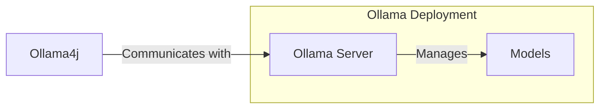

<div style="text-align: center">

### Ollama4j


A Java library (wrapper/binding) for [Ollama](https://ollama.ai/) server.

Find more details on the [website](https://amithkoujalgi.github.io/ollama4j/).


[](https://codecov.io/gh/amithkoujalgi/ollama4j)


</div>

[//]: # (![Hits]&#40;https://hits.seeyoufarm.com/api/count/incr/badge.svg?url=https%3A%2F%2Fgithub.com%2Famithkoujalgi%2Follama4j&count_bg=%2379C83D&title_bg=%23555555&icon=&icon_color=%23E7E7E7&title=hits&edge_flat=false&#41;)

[//]: # (![GitHub language count]&#40;https://img.shields.io/github/languages/count/amithkoujalgi/ollama4j&#41;)

## Table of Contents

- [How does it work?](#how-does-it-work)
- [Requirements](#requirements)
- [Installation](#installation)
- [API Spec](https://amithkoujalgi.github.io/ollama4j/docs/category/apis---model-management)
- [Javadoc Spec](https://amithkoujalgi.github.io/ollama4j/apidocs/)
- [Development](#development)
- [Contributions](#get-involved)
- [References](#references)

#### How does it work?



#### Requirements


[![][ollama-shield]][ollama] **Or** [![][ollama-docker-shield]][ollama-docker]

[ollama]: https://ollama.ai/

[ollama-shield]: https://img.shields.io/badge/Ollama-Local_Installation-blue.svg?style=just-the-message&labelColor=gray

[ollama-docker]: https://hub.docker.com/r/ollama/ollama

[ollama-docker-shield]: https://img.shields.io/badge/Ollama-Docker-blue.svg?style=just-the-message&labelColor=gray

#### Installation

Check the releases [here](https://github.com/amithkoujalgi/ollama4j/releases).


##### For Maven

1. In your Maven project, add this dependency:

```xml

<dependency>
    <groupId>io.github.amithkoujalgi</groupId>
    <artifactId>ollama4j</artifactId>
  <version>1.0.74</version>
</dependency>
```

2. Add repository to your project's pom.xml:

```xml

<repositories>
    <repository>
        <id>github</id>
        <name>GitHub Apache Maven Packages</name>
        <url>https://maven.pkg.github.com/amithkoujalgi/ollama4j</url>
        <releases>
            <enabled>true</enabled>
        </releases>
        <snapshots>
            <enabled>true</enabled>
        </snapshots>
    </repository>
</repositories>
```

3. Add GitHub server to settings.xml. (Usually available at ~/.m2/settings.xml)

```xml

<settings xmlns="http://maven.apache.org/SETTINGS/1.0.0"
          xmlns:xsi="http://www.w3.org/2001/XMLSchema-instance"
          xsi:schemaLocation="http://maven.apache.org/SETTINGS/1.0.0
                      http://maven.apache.org/xsd/settings-1.0.0.xsd">
    <servers>
        <server>
            <id>github</id>
            <username>YOUR-USERNAME</username>
            <password>YOUR-TOKEN</password>
        </server>
    </servers>
</settings>
```

##### For Gradle

In your Gradle project, add the dependency using the Kotlin DSL or the Groovy DSL:

```kotlin
dependencies {

    val ollama4jVersion = "1.0.74"

    implementation("io.github.amithkoujalgi:ollama4j:$ollama4jVersion")
}
 ```

```groovy
dependencies {
    implementation("io.github.amithkoujalgi:ollama4j:1.0.74")
}
```

[//]: # (Latest release:)

[//]: # ()

[//]: # (![Maven Central]&#40;https://img.shields.io/maven-central/v/io.github.amithkoujalgi/ollama4j&#41;)

[//]: # ()

[//]: # ([![][lib-shield]][lib])

[lib]: https://central.sonatype.com/artifact/io.github.amithkoujalgi/ollama4j

[lib-shield]: https://img.shields.io/badge/ollama4j-get_latest_version-blue.svg?style=just-the-message&labelColor=gray

#### API Spec

Find the full API specifications on the [website](https://amithkoujalgi.github.io/ollama4j/).

#### Development

Build:

```shell
make build
```

Run unit tests:

```shell
make ut
```

Run integration tests:

```shell
make it
```

#### Releases

Releases (newer artifact versions) are done automatically on pushing the code to the `main` branch through GitHub
Actions CI workflow.

#### Who's using Ollama4j?

- `Datafaker`: a library to generate fake data
    - https://github.com/datafaker-net/datafaker-experimental/tree/main/ollama-api
- `Vaadin Web UI`: UI-Tester for Interactions with Ollama via ollama4j
    - https://github.com/TEAMPB/ollama4j-vaadin-ui
- `ollama-translator`: Minecraft 1.20.6 spigot plugin allows to easily break language barriers by using ollama on the
  server to translate all messages into a specfic target language.
    - https://github.com/liebki/ollama-translator

#### Traction

[](https://star-history.com/#amithkoujalgi/ollama4j&Date)

### Areas of improvement

- [x] Use Java-naming conventions for attributes in the request/response models instead of the
  snake-case conventions. (
  possibly with Jackson-mapper's `@JsonProperty`)
- [x] Fix deprecated HTTP client code
- [x] Setup logging
- [x] Use lombok
- [x] Update request body creation with Java objects
- [ ] Async APIs for images
- [ ] Support for function calling with models like Mistral
    - [x] generate in sync mode
    - [ ] generate in async mode
- [ ] Add custom headers to requests
- [x] Add additional params for `ask` APIs such as:
    - [x] `options`: additional model parameters for the Modelfile such as `temperature` -
      Supported [params](https://github.com/jmorganca/ollama/blob/main/docs/modelfile.md#valid-parameters-and-values).
    - [x] `system`: system prompt to (overrides what is defined in the Modelfile)
    - [x] `template`: the full prompt or prompt template (overrides what is defined in the Modelfile)
    - [x] `context`: the context parameter returned from a previous request, which can be used to keep a
      short
      conversational memory
    - [x] `stream`: Add support for streaming responses from the model
- [ ] Add test cases
- [ ] Handle exceptions better (maybe throw more appropriate exceptions)

### Get Involved

Contributions are most welcome! Whether it's reporting a bug, proposing an enhancement, or helping
with code - any sort
of contribution is much appreciated.

### References

- [Ollama REST APIs](https://github.com/jmorganca/ollama/blob/main/docs/api.md)

### Credits

The nomenclature and the icon have been adopted from the incredible [Ollama](https://ollama.ai/)
project.


<div style="text-align: center">

**Thanks to the amazing contributors**

<a href="https://github.com/amithkoujalgi/ollama4j/graphs/contributors">
  
</a>

### Appreciate my work?

<a href="https://www.buymeacoffee.com/amithkoujalgi" target="_blank"></a>


</div>

