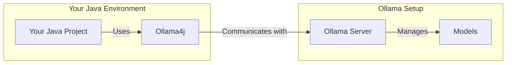

<div align="center">
  

### Ollama4j

</div>

<div align="center">
A Java library (wrapper/binding) for Ollama server.

_Find more details on the **[website](https://ollama4j.github.io/ollama4j/)**._


[](https://github.com/ollama4j/ollama4j/actions/workflows/run-tests.yml)

[](https://codecov.io/gh/ollama4j/ollama4j)
</div>


[//]: # (![GitHub repo size]&#40;https://img.shields.io/github/repo-size/ollama4j/ollama4j&#41;)

[//]: # (![GitHub top language]&#40;https://img.shields.io/github/languages/top/ollama4j/ollama4j&#41;)

[//]: # (![JitPack Downloads This Month Badge]&#40;https://img.shields.io/badge/dynamic/json?url=https%3A%2F%2Fjitpack.io%2Fapi%2Fdownloads%2Fio.github.ollama4j%2Follama4j&query=%24.month&label=JitPack%20Downloads%20-%20This%20Month&#41;)

[//]: # (![JitPack Downloads This Week Badge]&#40;https://img.shields.io/badge/dynamic/json?url=https%3A%2F%2Fjitpack.io%2Fapi%2Fdownloads%2Fio.github.ollama4j%2Follama4j&query=%24.week&label=JitPack%20Downloads%20-%20This%20Week&#41;)

[//]: # (![JitPack Downloads Per Month Badge]&#40;https://jitpack.io/v/ollama4j/ollama4j/month.svg&#41;)

[//]: # (![GitHub Downloads &#40;all assets, all releases&#41;]&#40;https://img.shields.io/github/downloads/ollama4j/ollama4j/total?label=GitHub%20Package%20Downloads&#41;)

[//]: # (![Hits]&#40;https://hits.seeyoufarm.com/api/count/incr/badge.svg?url=https%3A%2F%2Fgithub.com%2Follama4j%2Follama4j&count_bg=%2379C83D&title_bg=%23555555&icon=&icon_color=%23E7E7E7&title=hits&edge_flat=false&#41;)

[//]: # (![GitHub language count]&#40;https://img.shields.io/github/languages/count/ollama4j/ollama4j&#41;)

## Table of Contents

- [Capabilities](#capabilities)
- [How does it work?](#how-does-it-work)
- [Requirements](#requirements)
- [Usage](#usage)
    - [For Maven](#for-maven)
        - [Using Maven Central](#using-maven-central)
        - [Using GitHub's Maven Package Repository](#using-githubs-maven-package-repository)
    - [For Gradle](#for-gradle)
- [API Spec](#api-spec)
- [Examples](#examples)
- [Development](#development)
    - [Setup dev environment](#setup-dev-environment)
    - [Build](#build)
    - [Run unit tests](#run-unit-tests)
    - [Run integration tests](#run-integration-tests)
    - [Releases](#releases)
- [Get Involved](#get-involved)
- [Who's using Ollama4j?](#whos-using-ollama4j)
- [Growth](#growth)
    - [References](#references)
    - [Credits](#credits)
    - [Appreciate the work?](#appreciate-the-work)

## Capabilities

- **Text generation**: Single-turn `generate` with optional streaming and advanced options
- **Chat**: Multi-turn chat with conversation history and roles
- **Tool/function calling**: Built-in tool invocation via annotations and tool specs
- **MCP tool calling**: Call external tools via MCP protocol
- **Reasoning/thinking modes**: Generate and chat with “thinking” outputs where supported
- **Image inputs (multimodal)**: Generate with images as inputs where models support vision
- **Embeddings**: Create vector embeddings for text
- **Async generation**: Fire-and-forget style generation APIs
- **Custom roles**: Define and use custom chat roles
- **Model management**: List, pull, create, delete, and get model details
- **Connectivity utilities**: Server `ping` and process status (`ps`)
- **Authentication**: Basic auth and bearer token support
- **Options builder**: Type-safe builder for model parameters and request options
- **Timeouts**: Configure connect/read/write timeouts
- **Logging**: Built-in logging hooks for requests and responses
- **Metrics & Monitoring** 🆕: Built-in Prometheus metrics export for real-time monitoring of requests, model usage, and
  performance. *(Beta feature – feedback/contributions welcome!)* -
  Checkout [ollama4j-examples](https://github.com/ollama4j/ollama4j-examples) repository for details.

<div align="center">
  
</div>

## How does it work?



## Requirements

<p align="center">
  
  <a href="https://ollama.com/" target="_blank">
    
  </a>
</p>

## Usage

> [!NOTE]
> We are now publishing the artifacts to both Maven Central and GitHub package repositories.
>
> Track the releases [here](https://github.com/ollama4j/ollama4j/releases) and update the dependency version
> according to your requirements.

### For Maven

#### Using [Maven Central](https://central.sonatype.com/)

[![][ollama4j-mvn-releases-shield]][ollama4j-mvn-releases-link]

[ollama4j-mvn-releases-link]: https://central.sonatype.com/artifact/io.github.ollama4j/ollama4j/overview

[ollama4j-mvn-releases-shield]: https://img.shields.io/maven-central/v/io.github.ollama4j/ollama4j?display_name=release&style=for-the-badge&label=From%20Maven%20Central

In your Maven project, add this dependency:

```xml

<dependency>
    <groupId>io.github.ollama4j</groupId>
    <artifactId>ollama4j</artifactId>
    <version>1.1.0</version>
</dependency>
```

#### Using GitHub's Maven Package Repository

[![][ollama4j-releases-shield]][ollama4j-releases-link]

[ollama4j-releases-link]: https://github.com/ollama4j/ollama4j/releases

[ollama4j-releases-shield]: https://img.shields.io/github/v/release/ollama4j/ollama4j?display_name=release&style=for-the-badge&label=From%20GitHub%20Packages

1. Add `GitHub Maven Packages` repository to your project's `pom.xml` or your `settings.xml`:

```xml

<repositories>
    <repository>
        <id>github</id>
        <name>GitHub Apache Maven Packages</name>
        <url>https://maven.pkg.github.com/ollama4j/ollama4j</url>
        <releases>
            <enabled>true</enabled>
        </releases>
        <snapshots>
            <enabled>true</enabled>
        </snapshots>
    </repository>
</repositories>
```

2. Add `GitHub` server to settings.xml. (Usually available at ~/.m2/settings.xml)

```xml

<settings xmlns="http://maven.apache.org/SETTINGS/1.0.0"
          xmlns:xsi="http://www.w3.org/2001/XMLSchema-instance"
          xsi:schemaLocation="http://maven.apache.org/SETTINGS/1.0.0
                      http://maven.apache.org/xsd/settings-1.0.0.xsd">
    <servers>
        <server>
            <id>github</id>
            <username>YOUR-USERNAME</username>
            <password>YOUR-TOKEN</password>
        </server>
    </servers>
</settings>
```

3. In your Maven project, add this dependency:

```xml

<dependency>
    <groupId>io.github.ollama4j</groupId>
    <artifactId>ollama4j</artifactId>
    <version>1.1.0</version>
</dependency>
```

### For Gradle

1. Add the dependency

```groovy
dependencies {
    implementation 'io.github.ollama4j:ollama4j:1.1.0'
}
```

[//]: # (Latest release:)

[//]: # ()

[//]: # (![Maven Central]&#40;https://img.shields.io/maven-central/v/io.github.ollama4j/ollama4j&#41;)

[//]: # ()

[//]: # ([![][lib-shield]][lib])

[lib]: https://central.sonatype.com/artifact/io.github.ollama4j/ollama4j

[lib-shield]: https://img.shields.io/badge/ollama4j-get_latest_version-blue.svg?style=just-the-message&labelColor=gray

### API Spec

> [!TIP]
> Find the full API specifications on the [website](https://ollama4j.github.io/ollama4j/).

## Examples

For practical examples and usage patterns of the Ollama4j library, check out
the [ollama4j-examples](https://github.com/ollama4j/ollama4j-examples) repository.

## Development

Make sure you have `pre-commit` installed.

With `brew`:

```shell
brew install pre-commit
```

With `pip`:

```shell
pip install pre-commit
```

#### Setup dev environment

> **Note**
> If you're on Windows, install [Chocolatey Package Manager for Windows](https://chocolatey.org/install) and then
> install `make` by running `choco install make`. Just a little tip - run the command with administrator privileges if
> installation faiils.

```shell
make dev
```

#### Build

```shell
make build
```

#### Run unit tests

```shell
make unit-tests
```

#### Run integration tests

Make sure you have Docker running as this uses [testcontainers](https://testcontainers.com/) to run the integration
tests on Ollama Docker container.

```shell
make integration-tests
```

### Releases

Newer artifacts are published via GitHub Actions CI workflow when a new release is created from `main` branch.

## Get Involved

<div align="center">

<a href=""></a>
<a href=""></a>
<a href=""></a>
<a href=""></a>
<a href=""></a>

</div>

Contributions are most welcome! Whether it's reporting a bug, proposing an enhancement, or helping
with code - any sort of contribution is much appreciated.

<div style="font-size: 15px; font-weight: bold; padding-top: 10px; padding-bottom: 10px; border: 1px solid" align="center">
If you like or are use this project, please give us a ⭐. It's a free way to show your support.
</div>

## Who's using Ollama4j?

| #  | Project Name      | Description                                                                                                                                                        | Link                                                                                                                                                                                          |
|----|-------------------|--------------------------------------------------------------------------------------------------------------------------------------------------------------------|-----------------------------------------------------------------------------------------------------------------------------------------------------------------------------------------------|
| 1  | Datafaker         | A library to generate fake data                                                                                                                                    | [GitHub](https://github.com/datafaker-net/datafaker-experimental/tree/main/ollama-api)                                                                                                        |
| 2  | Vaadin Web UI     | UI-Tester for interactions with Ollama via ollama4j                                                                                                                | [GitHub](https://github.com/TEAMPB/ollama4j-vaadin-ui)                                                                                                                                        |
| 3  | ollama-translator | A Minecraft 1.20.6 Spigot plugin that translates all messages into a specific target language via Ollama                                                           | [GitHub](https://github.com/liebki/ollama-translator)                                                                                                                                         |
| 4  | AI Player         | A Minecraft mod that adds an intelligent "second player" to the game                                                                                               | [Website](https://modrinth.com/mod/ai-player), [GitHub](https://github.com/shasankp000/AI-Player), <br/> [Reddit Thread](https://www.reddit.com/r/fabricmc/comments/1e65x5s/comment/ldr2vcf/) |
| 5  | Ollama4j Web UI   | A web UI for Ollama written in Java using Spring Boot, Vaadin, and Ollama4j                                                                                        | [GitHub](https://github.com/ollama4j/ollama4j-web-ui)                                                                                                                                         |
| 6  | JnsCLI            | A command-line tool for Jenkins that manages jobs, builds, and configurations, with AI-powered error analysis                                                      | [GitHub](https://github.com/mirum8/jnscli)                                                                                                                                                    |
| 7  | Katie Backend     | An open-source AI-based question-answering platform for accessing private domain knowledge                                                                         | [GitHub](https://github.com/wyona/katie-backend)                                                                                                                                              |
| 8  | TeleLlama3 Bot    | A question-answering Telegram bot                                                                                                                                  | [Repo](https://git.hiast.edu.sy/mohamadbashar.disoki/telellama3-bot)                                                                                                                          |
| 9  | moqui-wechat      | A moqui-wechat component                                                                                                                                           | [GitHub](https://github.com/heguangyong/moqui-wechat)                                                                                                                                         |
| 10 | B4X               | A set of simple and powerful RAD tool for Desktop and Server development                                                                                           | [Website](https://www.b4x.com/android/forum/threads/ollama4j-library-pnd_ollama4j-your-local-offline-llm-like-chatgpt.165003/)                                                                |
| 11 | Research Article  | Article: `Large language model based mutations in genetic improvement` - published on National Library of Medicine (National Center for Biotechnology Information) | [Website](https://pmc.ncbi.nlm.nih.gov/articles/PMC11750896/)                                                                                                                                 |
| 12 | renaime           | A LLaVa powered tool that automatically renames image files having messy file names.                                                                               | [Website](https://devpost.com/software/renaime)                                                                                                                                               |

## Growth

<p align="center">
  <a href="https://star-history.com/#ollama4j/ollama4j&Date" target="_blank" rel="noopener noreferrer">
    
  </a>
</p>

[//]: # (![GitHub Issues or Pull Requests]&#40;https://img.shields.io/github/issues-raw/ollama4j/ollama4j&#41;)

[//]: # (![GitHub Issues or Pull Requests]&#40;https://img.shields.io/github/issues-closed-raw/ollama4j/ollama4j&#41;)

[//]: # (![GitHub Issues or Pull Requests]&#40;https://img.shields.io/github/issues-pr-raw/ollama4j/ollama4j&#41;)

[//]: # (![GitHub Issues or Pull Requests]&#40;https://img.shields.io/github/issues-pr-closed-raw/ollama4j/ollama4j&#41;)

[//]: # (![GitHub Discussions]&#40;https://img.shields.io/github/discussions/ollama4j/ollama4j&#41;)

### References

- [Ollama REST APIs](https://github.com/jmorganca/ollama/blob/main/docs/api.md)

### Credits

The nomenclature and the icon have been adopted from the incredible [Ollama](https://ollama.ai/)
project.

**Thanks to the amazing contributors**

<p align="center">
  <a href="https://github.com/ollama4j/ollama4j/graphs/contributors">
    
  </a>
</p>

#### Articles & Mentions

Ollama4j has been featured in a number of articles and community posts—huge thanks to everyone who helps spread the word!

<p align="center">
  <a href="https://youtu.be/XvmGqpzepDM?t=966" target="_blank">
    
  </a>
</p>

- **Running LLM locally using Java** — [Article by Stephan Janssen (LinkedIn)](https://www.linkedin.com/pulse/running-llm-locally-using-java-stephan-janssen-g4mue)
- **Java library announcement** — [Post by Markus Klenke (LinkedIn)](https://www.linkedin.com/posts/markus-klenke-61041086_github-amithkoujalgiollama4j-java-library-activity-7166431630939639808-JyEH)
- **Tame Your Llama: Run AI in Java**  
  - 🎤 [JNation Talk: Presented by Lutske de Leeuw](https://youtu.be/XvmGqpzepDM?t=966)  
  - 📝 [In-depth Forum Article](https://javapro.io/2025/10/15/tame-your-llama-run-ai-in-java/)  
  - 🐦 [Announcement on X (Twitter)](https://x.com/JAVAPROmagazin/status/1978347624265646211)
- **First Conversation with Deepseek Model** — [Post by Ghaffar Mallah (LinkedIn)](https://www.linkedin.com/posts/ghaffarmallah_ok-ai-i-finally-see-you-with-deepseek-hype-activity-7290019964533526529-G5cq)
- **From Llamas to Lightsabers: AI in Java** — [Post by Lutske (LinkedIn)](https://www.linkedin.com/posts/lutske_utrechtjug-tameyourllama-java-activity-7386315122748706816-6A_j)
- **LlamaFX Project** — [LinkedIn post by William Antônio Siqueira](https://www.linkedin.com/posts/william-ant%C3%B4nio-siqueira-968bba14_yesterday-i-started-a-pet-project-to-test-activity-7311293892551712768-hWcD)
- **Exploring AI with Groovy™** — [LinkedIn post by Paul William King](https://www.linkedin.com/posts/paulwilliamking_embabel-groovylang-ollama4j-activity-7383995871564226561-ZHzt) and [Groovy blog](https://groovy.apache.org/blog/groovy-ai)

### Appreciate the work?

<p align="center">
  <a href="https://www.buymeacoffee.com/amithkoujalgi" target="_blank"></a>
</p>
