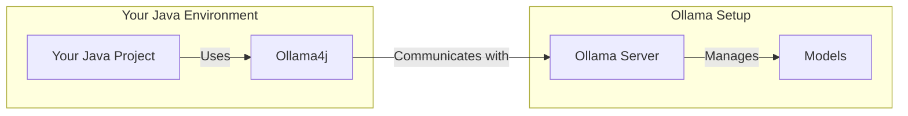

import LatestRelease from '@site/src/components/LatestRelease';
import AddToYourProject from '@site/src/components/AddToYourProject';

# Introduction

### 🦙 What is Ollama?

[Ollama](https://ollama.ai/) is an advanced AI tool that allows users to easily set up and run large language models
locally (in CPU and GPU
modes). With Ollama, users can leverage powerful language models such as Llama 2 and even customize and create their own
models.

### 👨‍💻 Why Ollama4j?

Ollama4j was built for the simple purpose of integrating Ollama with Java applications.



### Getting Started

#### What you'll need

- **[Ollama](https://ollama.ai/download)**
- **[Oracle JDK](https://www.oracle.com/java/technologies/javase/jdk11-archive-downloads.html)** or
  **[Open JDK](https://jdk.java.net/archive/)** 11.0 or above.
- **[Maven](https://maven.apache.org/download.cgi)**

#### Start Ollama server

The easiest way of getting started with Ollama server is with [Docker](https://docs.docker.com/get-started/overview/).
But if you choose to run the
Ollama server directly, **[download](https://ollama.ai/download)** the distribution of your choice
and follow the installation process.

#### With Docker

##### Run in CPU mode:

```bash
docker run -it -v ~/ollama:/root/.ollama -p 11434:11434 ollama/ollama
```

##### Run in GPU mode:

```bash
docker run -it --gpus=all -v ~/ollama:/root/.ollama -p 11434:11434 ollama/ollama
```

You can type this command into Command Prompt, Powershell, Terminal, or any other integrated
terminal of your code editor.

The command runs the Ollama server locally at **http://localhost:11434/**.

#### Setup your project

Add the dependency to your project's `pom.xml`.

<AddToYourProject/>

<div style={{ marginTop: '2rem', marginBottom: '2rem', fontSize: '1em', textAlign: 'left', display: 'flex', justifyContent: 'left'}}>
    <LatestRelease showReleaseDate={true} style={{textAlign: 'left', fontWeight: 'normal'}}/>
</div>

Find the latest version of the library from [Maven Central Repository](https://central.sonatype.com/artifact/io.github.ollama4j/ollama4j).

You might want to include an implementation of [SL4J](https://www.slf4j.org/) logger in your `pom.xml` file. For
example,

Use `slf4j-jdk14` implementation:

```xml
<dependency>
    <groupId>org.slf4j</groupId>
    <artifactId>slf4j-jdk14</artifactId>
    <version>2.0.9</version> <!--Replace with appropriate version-->
</dependency>
```

or use `logback-classic` implementation:

```xml
<dependency>
    <groupId>ch.qos.logback</groupId>
    <artifactId>logback-classic</artifactId>
    <version>1.3.11</version> <!--Replace with appropriate version-->
</dependency>
```

or use other suitable implementations.

Create a new Java class in your project and add this code.

```java
import io.github.ollama4j.OllamaAPI;

public class OllamaAPITest {

    public static void main(String[] args) {
        OllamaAPI ollamaAPI = new OllamaAPI();

        boolean isOllamaServerReachable = ollamaAPI.ping();

        System.out.println("Is Ollama server running: " + isOllamaServerReachable);
    }
}
```
This uses the default Ollama host as `http://localhost:11434`.

Specify a different Ollama host that you want to connect to.

```java
import io.github.ollama4j.OllamaAPI;

public class OllamaAPITest {

    public static void main(String[] args) {
        String host = "http://localhost:11434/";

        OllamaAPI ollamaAPI = new OllamaAPI(host);

        ollamaAPI.setVerbose(true);

        boolean isOllamaServerReachable = ollamaAPI.ping();

        System.out.println("Is Ollama server running: " + isOllamaServerReachable);
    }
}
```
